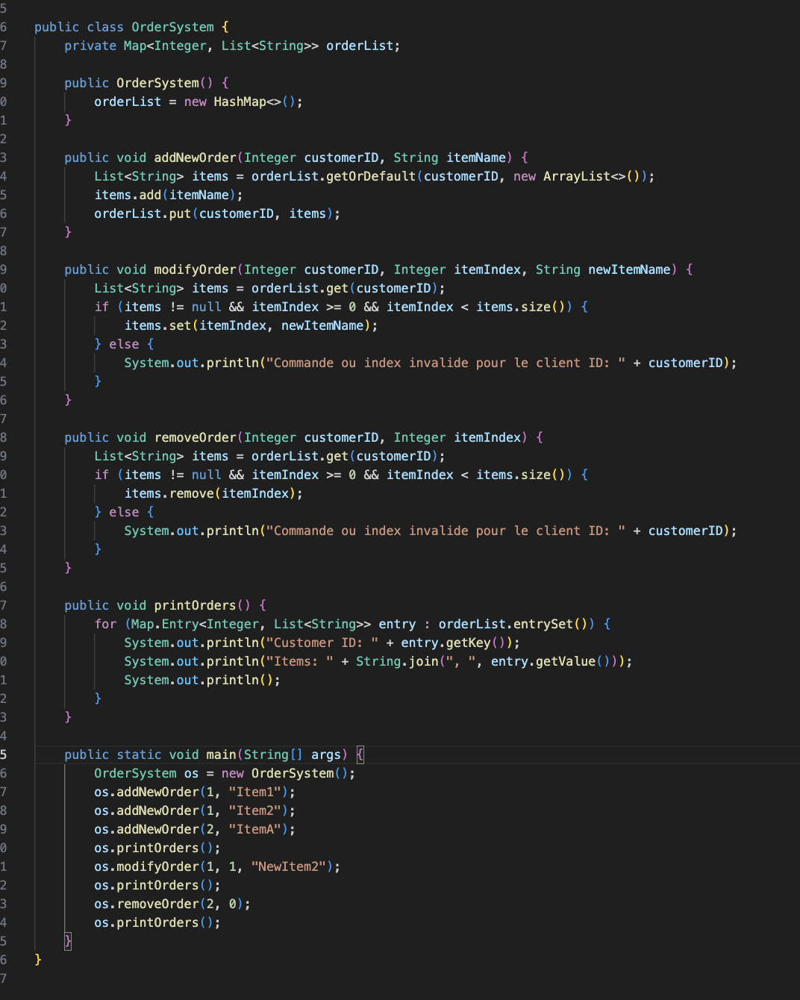

# partielSC

## 1. Forkez ce repo ou suivez son exemple de format dans un repo que vous devez me partager à l'adresse remi.hamy@gmail.com
## Format du nom de repo PartielSoftwareCraftmanship"< Votre NOM PRENOM >"

## 2. Partie questions
Veuillez copier les questions et y répondre dans ce README pour les questions textes.
Pour les autres questions, mettez votre code dans le dossier CODE à la racine de votre repo

1. Corrigez ce code écrit par le stagiaire de votre équipe qui n’est pas encore familier avec le méter

    > Fichier "question1.java"
    > 

2. Qu’est ce que du code propre ?

    > Selon moi, plusieurs éléments définissent un code propre, premièrement, sa lisibilité, par l'usage de nom compréhensibles par tous (variables, fonctions, classes, interface etc...). 
    > L'usage des commentaires doit être limité, car le code doit être assez clair de lui-même pour être compris rapidement
    > Le code doit suivre les conventions indiqués par la communauté internationale ou alors relative à son entourage (entreprise, équipe etc...)

    > Il doit également être simple, il faut suivre la méthode du rasoir d'ockham, il est inutile de faire des solutions complexes pour des problèmes simple...
    > Il doit être maintenable, une changement dans ce code ne soit pas provoquer des nouvelles erreurs, il doit aussi être facielement debogagable, et ainsi il doit donc être évolutif.

    > Il ne doit pas se répeter (règle du D.R.Y, don't repeat yourself)

    > Il doit être testé, car un code non testé ce n'est qu'une moitié de code. En effet il faut qu'il soit testé grâce a des méthodes telles que le TDD (test driven devleopment), et il faut automatisé ces tests

3. De votre expérience de l’agilité en entreprise, en vous basant sur les piliers du manifeste vu en cours. Que pourriez vous améliorer dans la gestion de vos projets ?

    > Je pourrais m'améliorer en tant que developpeur, en effet je fais encore des erreurs tels que le non-respect du DRY, ou alors de mal nommer une variable, une fonction etc... Mon code doit être plus maintenable.

    > Je dois également apprendre à tester mon code, car c'est une étape que j'ignore bien trop souvent dans la gestion de mes projets personnels notamment

4. Code review et proposition de code:

    > Code review: 
        - Responsabilité unique :
            La méthode processOrder réalise plusieurs tâches distinctes, ce qui va à l'encontre du principe de responsabilité unique (SRP). Il vaut mieux la séparer en plusieurs petites méthodes à la place.
        -
            Utiliser une exception générique comme RuntimeException pour signaler une indisponibilité d'article rend le code illisible. Il vaut mieux d'utiliser une exception spécifique.
        - Réutilisation du code :
            Le calcul de la remise est directement implémenté dans "LoyalCustomerOrder", elle pourrait être mise ailleurs dans une méthode dédidée afin que le code devienne plus lisibile et réutilisable (DRY)
        - Une injection de dépendance pourrait être utilisé à la place de la création de par exemple, Database, EmailService et InventorySystem dans le constructeur, ainsi il serait plus facilement testable

5. Place au kata!

    > Choix de la technologie: Node.js
    > Npm install au lancement afin d'installer les packets node
    > Cmd de test: test
    > Racine: index.js

